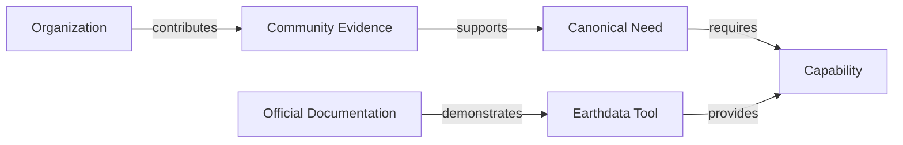

# Earthdata Community Insights

Earthdata Community Insights (ECI) is a prototype knowledge platform that connects community evidence, canonical needs, Earthdata capabilities, Earthdata tools, and authoritative documentation.

Its purpose is to help NASA understand what users need, why those needs exist, which Earthdata capabilities address them, and where supported solutions already exist.

## Knowledge model



The application preserves original evidence, uses human-reviewed canonical needs, and treats automated matches as suggestions rather than authoritative conclusions.

## Current capabilities

- Import and browse community evidence and canonical needs
- Trace needs to sources and organizations
- Maintain an Earthdata tool catalog
- Import GitHub issues, pull requests, and releases as engineering provenance
- Match needs to candidate implementation artifacts
- Review and classify proposed relationships
- Maintain a capability catalog and official capability evidence
- Switch between full and curated demo datasets

The initial Earthdata tool scope includes Earthdata Search, Worldview, GIBS, CMR, and Harmony.

## Technology

| Component | Technology |
|---|---|
| User interface | Streamlit |
| API | FastAPI |
| Database | MariaDB |
| Local deployment | Docker Compose |
| Import and matching | Python batch services |

## Run locally

### Requirements

- Git
- Docker Desktop with Docker Compose
- A modern web browser

### Setup

```powershell
git clone https://github.com/matthewtisdale1/Earthdata_Community_Insights.git
Set-Location Earthdata_Community_Insights
Copy-Item .env.example .env
notepad .env
```

Set local database credentials and any required GitHub token in `.env`. Do not commit `.env` or real credentials.

Build and start the application:

```powershell
docker compose up --build -d
```

Open:

- UI: `http://127.0.0.1:8501`
- API documentation: `http://127.0.0.1:8000/docs`
- API health check: `http://127.0.0.1:8000/health`

Useful commands:

```powershell
# View status
docker compose ps

# View logs
docker compose logs -f

# Rebuild API and UI
docker compose build --no-cache api ui
docker compose up -d --force-recreate --no-deps api ui

# Stop while preserving data
docker compose down
```

## Dataset modes

Use the full dataset for analysis:

```powershell
.\scripts\use-dataset.ps1 full
```

Create and use a curated demo centered on a specific need:

```powershell
.\scripts\refresh-demo.ps1 -NeedCodes NEED-0042 -MaxArtifactsPerNeed 5
.\scripts\use-dataset.ps1 demo
```

## Repository structure

```text
api/                 FastAPI application
ui/                  Streamlit application
importer/            Community-data importer
github_importer/     GitHub synchronization
matcher/             Candidate relationship matching
database/            Schema, migrations, and seed data
scripts/             Local maintenance and dataset scripts
docs/                Concise product and design documentation
```

## Documentation

- [Design Specification](docs/Design_Specification.md) — vision, domain model, architecture, governance, and roadmap
- [Data Dictionary](docs/Data_Dictionary.md) — concise definitions of the authoritative domain objects and relationships

The documentation is intentionally compact so that it remains useful to both people and AI coding assistants.

## Design principles

1. Preserve original community evidence.
2. Keep canonical needs solution-independent.
3. Keep capabilities implementation-independent.
4. Prefer official documentation when demonstrating available capabilities.
5. Treat GitHub artifacts as engineering provenance, not automatic proof that a need is solved.
6. Require human review before relationships become authoritative.
7. Keep every relationship traceable to its source.

## Current status

ECI is an internal prototype and research effort. Imported records, normalized needs, automated scores, and proposed relationships should not be treated as authoritative program decisions until reviewed.

## PI planning and ASSET ownership

The planning extension adds PIs, configurable teams, need-linked deliverables, acceptance criteria, completion evidence, reassignment history, and independent need-outcome reviews. Run `scripts/enable-planning.ps1` to apply its additive migration and rebuild the local app. See [PI Planning](docs/PI_Planning.md) for workflow, source-review findings, and prototype limits.
