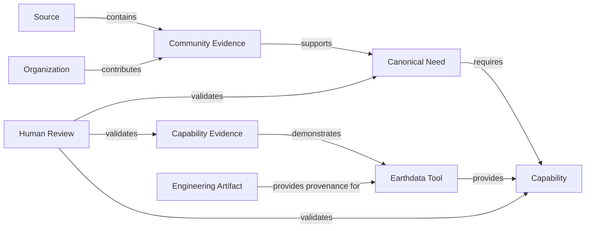
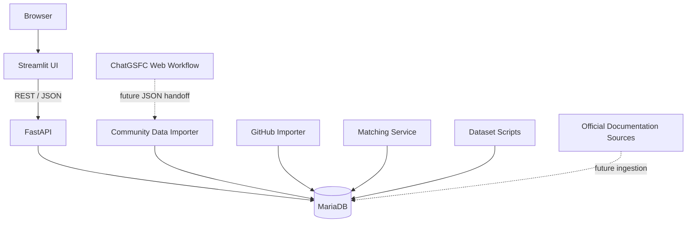
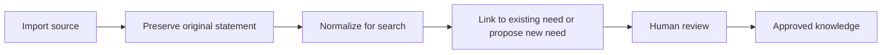
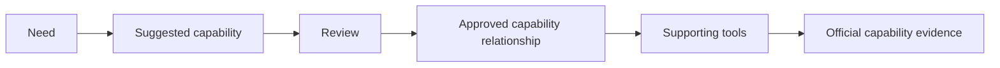

# Earthdata Community Insights Design Specification

**Status:** Draft baseline  
**Scope:** Current prototype and near-term direction  
**Audience:** Product owners, reviewers, developers, and AI coding assistants

## 1. Purpose

Earthdata Community Insights (ECI) is a knowledge platform for understanding how recurring community needs relate to Earthdata capabilities, tools, and authoritative documentation.

NASA receives valuable feedback through User Working Groups, workshops, reports, surveys, interviews, support channels, and software repositories. That knowledge is often distributed across documents and systems, uses inconsistent terminology, and is difficult to compare over time. ECI provides a reviewable structure that preserves the original evidence while connecting related information.

### North star

> Every Earthdata community need should be traceable to evidence, connected to capabilities, and linked to authoritative information about available solutions.

### Primary questions

ECI is designed to answer:

- What recurring needs are being expressed by the Earthdata community?
- What original evidence supports each canonical need?
- Which organizations and source reports raised the need?
- Which functional capabilities are required?
- Which Earthdata tools provide those capabilities?
- What official documentation demonstrates that a capability is available?
- Which needs remain unresolved or only partially addressed?

## 2. Scope and principles

### In scope

- Community evidence and source traceability
- Human-reviewed canonical needs
- Organizations and community context
- Earthdata capabilities and capability categories
- Earthdata tools and approved external sources
- Official documentation, tutorials, API references, and release information
- GitHub issues, pull requests, and releases as engineering provenance
- Suggested and reviewed relationships
- Curated demo datasets
- Future AI-assisted extraction through a staged review process

### Out of scope

ECI does not replace GitHub, Jira, Earthdata Search, CMR, Harmony, Worldview, GIBS, documentation websites, or help-desk systems. Those systems remain authoritative for their own functions. ECI connects selected information from them to the community-needs model.

### Design principles

1. **Evidence before conclusions.** Canonical needs must remain traceable to original evidence.
2. **Human review establishes authority.** Automated extraction and matching create candidates, not facts.
3. **Needs are solution-independent.** A need describes an outcome, not a preferred product.
4. **Capabilities are implementation-independent.** A capability describes what can be done, not how one product implements it.
5. **Documentation before engineering provenance.** Official user-facing information is the preferred proof that a capability exists.
6. **Preserve provenance.** The system records why a relationship was created and whether it was machine-suggested or human-reviewed.
7. **Keep the model understandable.** The application should favor a small number of clear domain concepts over unnecessary abstraction.

## 3. Domain model

### Community evidence

An original statement, observation, recommendation, pain point, or desired outcome extracted from a source. Its original wording and source location are preserved. Normalized wording may be stored separately to support search and comparison.

### Canonical need

A concise, human-reviewed statement that represents the shared intent of one or more evidence records. A canonical need should usually follow this pattern:

> A user group needs a capability or outcome so that it can achieve a desired result.

Canonical wording may be edited for grammar and clarity, but edits must not change the intent of the supporting evidence.

### Capability

A reusable function that helps satisfy one or more needs. Capabilities are organized into categories and may include synonyms and relationships to other capabilities.

Examples include spatial subsetting, temporal search, interactive visualization, API documentation, and asynchronous processing.

### Earthdata tool

An operational application, platform, service, library, or interface that provides one or more capabilities. Initial scope includes Earthdata Search, Worldview, GIBS, CMR, and Harmony.

### Capability evidence

An authoritative resource demonstrating that a tool provides a capability. Preferred sources are official documentation, API references, tutorials, examples, and release notes.

### Engineering artifact

An issue, pull request, release, commit, or related software-development record. Engineering artifacts may explain implementation history or planned work but do not automatically prove that a user-facing capability is currently available.

### Review

A human decision that confirms, modifies, rejects, or marks a proposed relationship as uncertain. Review status must remain distinguishable from machine-generated suggestions.

## 4. Capability framework

The capability framework provides a common vocabulary for describing what Earthdata users need and what Earthdata tools provide.

### Initial categories

| Category | Examples |
|---|---|
| Discovery and Search | Collection search, granule search, spatial search, temporal search, variable search, faceted filtering |
| Data Access and Delivery | Download, bulk access, cloud access, programmatic access, streaming, authentication |
| Subsetting and Transformation | Spatial, temporal, variable, and vertical subsetting; reprojection; reformatting; aggregation |
| Visualization and Analysis | Interactive maps, plotting, time-series views, GIS integration, notebooks, WMS, WMTS, WCS, OGC API services |
| Metadata and Interoperability | Metadata quality, export, harmonization, citation, provenance, STAC, standards compliance |
| Documentation and User Support | Product documentation, API documentation, tutorials, examples, workflow guidance, training |
| Processing and Workflow | Asynchronous jobs, batch processing, workflow orchestration, job monitoring, reproducibility |
| Reliability and Operations | Availability, performance, scalability, status reporting, logging, operational monitoring |

The database is the source of truth for individual capability records. This document defines the rules used to curate them:

- Use a clear functional name, preferably a noun phrase.
- Give each capability one preferred name and stable code.
- Record common synonyms without creating duplicate capabilities.
- Define what the capability includes and, where ambiguity is likely, what it excludes.
- Link capabilities to tools only when supported by reviewed capability evidence.
- Allow cross-category relationships; for example, WCS is primarily grouped under Visualization and Analysis but may relate to data access, subsetting, and reformatting.

## 5. System architecture

### User interface

The Streamlit application provides dashboards and detail views for needs, evidence, organizations, tools, capabilities, capability evidence, and reviews. Detail pages should emphasize relationships so that users can move from evidence to a need, from a need to required capabilities, and from capabilities to tools and supporting documentation.

### API

FastAPI provides read and review endpoints used by the UI. API modules currently build on a shared application and database-engine context. Endpoints should return domain-oriented representations rather than expose database implementation details unnecessarily.

### Database

MariaDB is the system of record for imported evidence, curated knowledge, tool catalogs, solution evidence, and relationship reviews. Schema changes are applied through ordered SQL migrations.

### Batch services

- The community-data importer loads structured source records.
- The GitHub importer synchronizes approved repositories.
- The matcher proposes need-to-artifact relationships using lexical and capability-aware scoring.
- Dataset scripts create a curated demo database and switch the API/UI between full and demo modes.

### Local deployment

Docker Compose runs MariaDB, FastAPI, Streamlit, and optional batch services. Environment-specific credentials are stored in `.env`, which must not be committed.

### Future deployment

A future NGAP deployment may map containers to ECS/Fargate, MariaDB to Amazon RDS, documents to S3, secrets to Secrets Manager, and logs to CloudWatch. Those choices are future deployment targets rather than requirements of the current prototype.

## 6. Information lifecycle

### Community evidence and needs

The system should prefer linking new evidence to an existing need when the intent is substantially the same. It should not create a new need solely because the wording differs.

### Capability relationships

### GitHub artifacts

GitHub artifacts are imported and scored as candidate relationships. Reviewers classify them using relationship types such as tracks, proposes, partially addresses, fully addresses, implements, documents, or unrelated.

An artifact's closed or merged state must not automatically mark a community need as solved.

### Future document import

Until direct ChatGSFC API access is available, the intended workflow is:

1. Export existing needs and capabilities from ECI.
2. Upload those reference files and a source document to the ChatGSFC web interface.
3. Request structured JSON containing candidate evidence, need matches, and capability matches.
4. Import the JSON into staging tables.
5. Validate codes and required fields.
6. Promote records only after human review.

AI results must not write directly to authoritative knowledge tables.

## 7. Review and governance

| Information | Primary authority |
|---|---|
| Original evidence | Source document or system |
| Canonical need wording | Human reviewer |
| Capability definition | Curated capability framework |
| Tool catalog record | Curated tool catalog |
| Capability evidence | Official source plus human review |
| Engineering artifact | Source repository |
| Proposed relationship | Machine suggestion until reviewed |
| Approved relationship | Human reviewer |

### Quality expectations for canonical needs

Reviewers should flag:

- sentence fragments or grammar errors;
- vague wording without a clear outcome;
- multiple independent needs combined into one statement;
- duplicate or near-duplicate needs;
- wording that prescribes a specific product unnecessarily;
- wording unsupported by the associated evidence.

The application should eventually retain edit history for canonical wording, including previous text, revised text, reviewer, date, and reason.

### Review statuses

At minimum, relationships should distinguish:

- Pending
- Confirmed
- Rejected
- Uncertain

Automated jobs may replace older pending suggestions, but they must not overwrite reviewed decisions.

## 8. Current state and roadmap

### Current prototype

The prototype currently supports:

- evidence, needs, organizations, and sources;
- tool and repository catalogs;
- Harmony GitHub artifact ingestion;
- lexical and capability-aware matching;
- human review of candidate relationships;
- capability and capability-evidence views;
- documentation-first evidence for selected Harmony capabilities;
- full and curated demo datasets.

### Near-term priorities

1. Clean grammar and consistency across the canonical need catalog.
2. Broaden and curate the capability framework.
3. Add capability definitions, synonyms, and related-capability links.
4. Expand official documentation coverage beyond Harmony.
5. Improve capability and need quality-review workflows.
6. Keep the curated demo dataset small and defensible.

### Later priorities

- ChatGSFC-assisted document import through JSON staging
- Documentation and release-note ingestion
- Capability coverage and gap analysis
- Cross-tool comparison
- Knowledge-graph visualization
- NGAP pilot deployment

## 9. Maintenance rule

Documentation should remain intentionally concise. Update this design specification only when the product mission, domain model, architecture, governance, or roadmap changes. Implementation details that can be understood directly from code, migrations, or API documentation should not be duplicated here.

## 10. PI planning extension

ECI now includes a local planning workspace for need-linked deliverables, PI dates, configurable ASSET/DAAC/enterprise teams, ownership history, completion evidence, and independent outcome reviews. Existing engineering systems remain authoritative for their own work items; this prototype stores planning commitments and external references without synchronizing status automatically. Historical source organizations are preserved. Formal organizational transition mappings remain future work. See [PI Planning](PI_Planning.md).
