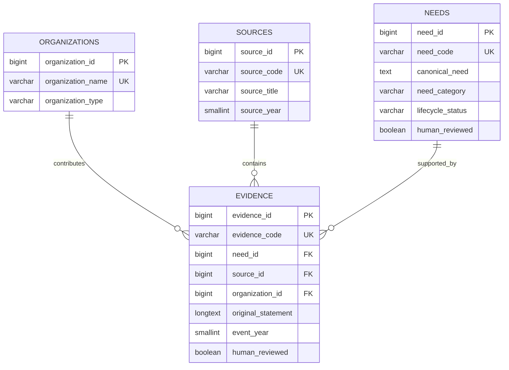
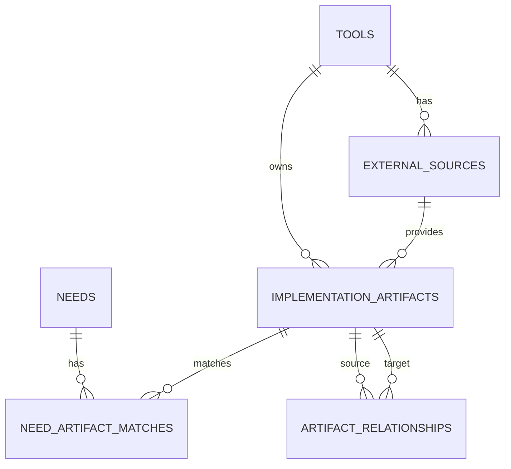

# Data Model

## Purpose

The data model separates what the community said from the normalized need used for analysis and planning.

```text
Source document
      │
      ▼
Evidence statement ──► Canonical need
      │                     │
      ├── Organization      ├── Category
      ├── Year              ├── Desired outcome
      ├── Source location   ├── Lifecycle status
      └── Original wording  └── Review fields
```

## Current entities

### `organizations`

Represents an organization, working group, DAAC, community, or other body associated with evidence.

Key fields:

- `organization_id`
- `organization_name`
- `organization_type`

### `sources`

Represents a report, workbook, meeting artifact, or other document from which evidence was extracted.

Key fields:

- `source_id`
- `source_code`
- `source_title`
- `source_type`
- `source_year`
- `file_name`
- `notes`

### `needs`

Represents a normalized, canonical statement of a recurring community need.

Key fields:

- `need_id`
- `need_code`
- `canonical_need`
- `need_summary`
- `need_category`
- `desired_outcome`
- `lifecycle_status`
- `priority`
- `trend`
- `human_reviewed`
- `reviewer`
- `review_date`
- `notes`

The canonical wording may change during human review. It must remain linked to the evidence that supports it.

### `evidence`

Represents an original statement or observation supporting a canonical need.

Key fields:

- `evidence_id`
- `evidence_code`
- `need_id`
- `source_id`
- `organization_id`
- `original_statement`
- `normalized_statement`
- `evidence_type`
- `event_year`
- `user_community`
- `evidence_strength`
- `match_confidence`
- `match_method`
- `source_location`
- `human_reviewed`
- `duplicate_evidence`
- `context_rationale`

`original_statement` should preserve the source wording. `normalized_statement` supports search and comparison but does not replace the original.

### `review_decisions`

Provides an audit-oriented record of review activity.

Key fields:

- `review_id`
- `entity_type`
- `entity_key`
- `decision_type`
- `previous_value`
- `new_value`
- `reviewer`
- `review_notes`
- `reviewed_at`

### `v_need_summary`

Aggregates evidence-level information for each canonical need, including:

- Evidence count
- Source count
- Organization count
- Year count
- First and last observed year
- Prototype signal score

The signal score is a prioritization aid, not an authoritative measure of importance.

## Current relationships



## Planned implementation-intelligence entities

### `tools`

Earthdata applications and services such as Earthdata Search, Worldview, GIBS, CMR, and Harmony.

### `external_sources`

Approved repositories, documentation sites, release feeds, roadmaps, or other sources associated with a tool.

### `implementation_artifacts`

Neutral representation of GitHub issues, pull requests, releases, documentation pages, roadmap items, and tool features.

The neutral term is important because not every ticket represents a solution.

### `need_artifact_matches`

Many-to-many bridge between needs and artifacts. Stores automated scores, relationship classification, review status, reviewer, and review notes.

### `artifact_relationships`

Connects artifacts to one another, such as:

```text
Issue ──implements/closed_by──► Pull request
Pull request ──included_in──► Release
Feature ──documented_by──► Documentation page
```

## Planned expanded relationship model



## Data-quality rules

1. Stable codes such as `NEED-####` and `EVID-####` should not be reused.
2. Original evidence text should not be silently rewritten.
3. Duplicate evidence should be flagged rather than deleted when traceability matters.
4. Automated matches must retain method and confidence information.
5. Human-confirmed and pending matches must remain distinguishable.
6. Artifact state must not be used as a substitute for implementation relationship.
7. All externally sourced records should retain a source URL or source location.
